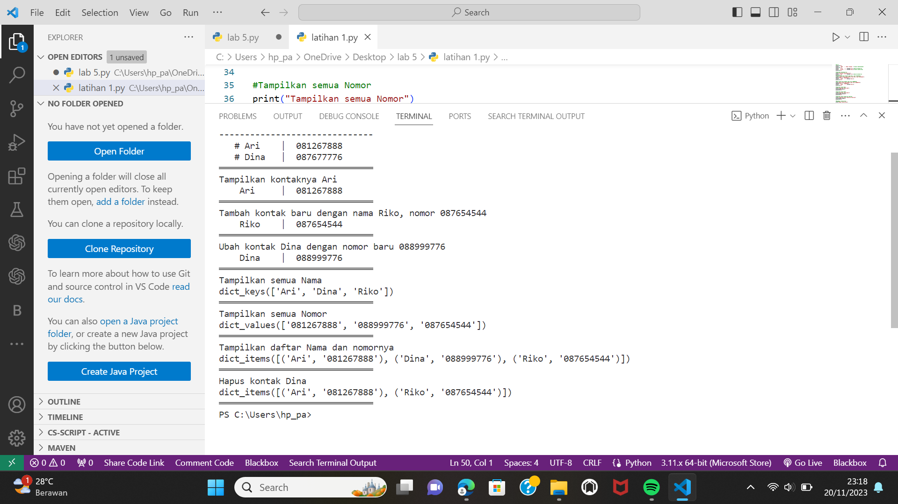
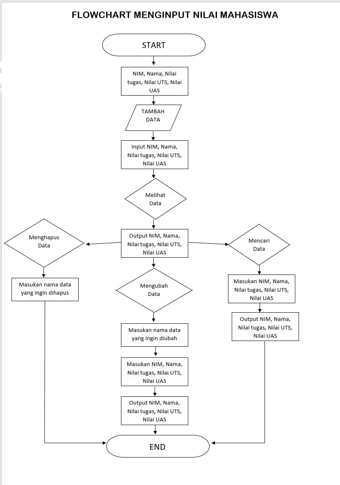
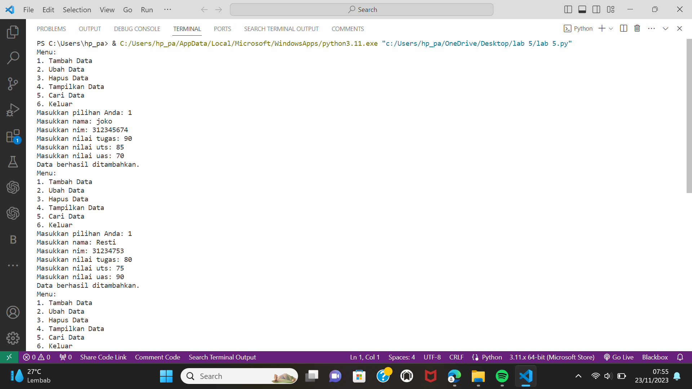

# lab-5 

# source code latihan 5

``` python

#Dictionary
daftarKontak = {"Nama":"Nomer Telpon"}
kontak       = {'Ari':'081267888', 'Dina' : '087677776'}

#print
print(30*"═")
print("    Nama    |  Nomor Telepon  ") #prinr daftarkontak
print(30*"-")
print("   # Ari    | ", kontak['Ari']) #print kontak Ari
print("   # Dina   | ", kontak['Dina']) #print kontak Dina
print(30*"═")

#Tampilkan kontaknya Ari
print("Tampilkan kontaknya Ari")
print("    Ari     | ", kontak['Ari']) #print kontak Ari
print(30*"═")
#Tambah kontak baru dengan nama Riko, nomor 087654544
print("Tambah kontak baru dengan nama Riko, nomor 087654544")
kontak['Riko'] = '087654544'
print("    Riko    | ", kontak['Riko'])
print(30*"═")

#Ubah kontak Dina dengan nomor baru 088999776
print("Ubah kontak Dina dengan nomor baru 088999776")
kontak['Dina'] = '088999776'
print("    Dina    | ", kontak['Dina'])
print(30*"═")

#Tampilkan semua Nama
print("Tampilkan semua Nama")
print(kontak.keys())
print(30*"═")

#Tampilkan semua Nomor
print("Tampilkan semua Nomor")
print(kontak.values())
print(30*"═")

#Tampilkan daftar Nama dan nomornya
print("Tampilkan daftar Nama dan nomornya")
print(kontak.items())
print(30*"═")

#MengHapus kontak Dina
print("Hapus kontak Dina")
kontak.pop('Dina')
print(kontak.items())
print(30*"═") 
 ```

# Hasil output


# Praktikum 5


# soal praktikum 5
<br>Buat program sederhana yang akan menampilkan daftar nilai mahasiswa, dengan ketentuan :
<br>Program dibuat dengan menggunakan Dictionary
<br>Tampilkan menu pilihan: (Tambah Data, Ubah Data, Hapus Data, Tampilkan Data, Cari Data)
<br>Nilai Akhir diambil dari perhitungan 3 komponen nilai (tugas: 30%, uts: 35%, uas: 35%)
<br>Buat flowchart dan penjelasan programnya pada README.md.
<br>Commit dan push repository ke github

# FLowchart


# Hasil Output


# Penjelasan
1.Membuat data dictionary untuk menyimpan data mahasiswa 
``` python
data_mahasiswa = {}
```
2.fungsi untuk menampilkan menu pilihan 
```python
def tampilkan_menu():
    print("Menu:")
    print("1. Tambah Data")
    print("2. Ubah Data")
    print("3. Hapus Data")
    print("4. Tampilkan Data")
    print("5. Cari Data")
    print("6. Keluar")
```
 3.Fungsi untuk menambah data mahasiswa
 ```python
def tambah_data():
    # Meminta input nama, nim, nilai tugas, uts, dan uas
    nama = input("Masukkan nama: ")
    nim = input("Masukkan nim: ")
    tugas = int(input("Masukkan nilai tugas: "))
    uts = int(input("Masukkan nilai uts: "))
    uas = int(input("Masukkan nilai uas: "))

    # Menghitung nilai akhir dengan bobot 30% tugas, 35% uts, dan 35% uas
    nilai_akhir = round(0.3 * tugas + 0.35 * uts + 0.35 * uas, 2)

    # Menyimpan data mahasiswa ke dalam dictionary
    data_mahasiswa[nim] = [nama, tugas, uts, uas, nilai_akhir]

    # Menampilkan pesan bahwa data berhasil ditambahkan
    print("Data berhasil ditambahkan.")

 ```
4.fungsi untuk mengubah data mahasiswa
``` python
def ubah_data():
    # Meminta input nim yang ingin diubah
    nim = input("Masukkan nim yang ingin diubah: ")

    # Mengecek apakah nim ada dalam dictionary
    if nim in data_mahasiswa:
        # Meminta input data baru
        nama = input("Masukkan nama baru: ")
        tugas = int(input("Masukkan nilai tugas baru: "))
        uts = int(input("Masukkan nilai uts baru: "))
        uas = int(input("Masukkan nilai uas baru: "))

        # Menghitung nilai akhir baru dengan bobot 30% tugas, 35% uts, dan 35% uas
        nilai_akhir = round(0.3 * tugas + 0.35 * uts + 0.35 * uas, 2)

        # Mengubah data mahasiswa dalam dictionary
        data_mahasiswa[nim] = [nama, tugas, uts, uas, nilai_akhir]

        # Menampilkan pesan bahwa data berhasil diubah
        print("Data berhasil diubah.")
    else:
        # Menampilkan pesan bahwa nim tidak ditemukan
        print("Nim tidak ditemukan.")
```
5.Fungsi untuk menghapus data mahasiswa
```python
def hapus_data():
    # Meminta input nim yang ingin dihapus
    nim = input("Masukkan nim yang ingin dihapus: ")

    # Mengecek apakah nim ada dalam dictionary
    if nim in data_mahasiswa:
        # Menghapus data mahasiswa dari dictionary
        del data_mahasiswa[nim]

        # Menampilkan pesan bahwa data berhasil dihapus
        print("Data berhasil dihapus.")
    else:
        # Menampilkan pesan bahwa nim tidak ditemukan
        print("Nim tidak ditemukan.")
```
6.Fungsi untuk menampilkan data mahasiswa
``` python
def tampilkan_data():
    # Mengecek apakah dictionary kosong
    if data_mahasiswa:
        # Menampilkan header tabel
        print("Daftar Nilai Mahasiswa")
        print("=================================================================")
        print("| No |     Nama     |    NIM    | Tugas | UTS | UAS | Nilai Akhir |")
        print("=================================================================")

        # Menampilkan data mahasiswa dengan nomor urut
        no = 1
        for nim, data in data_mahasiswa.items():
            nama = data[0]
            tugas = data[1]
            uts = data[2]
            uas = data[3]
            nilai_akhir = data[4]
            print(f"| {no:2} | {nama:12} | {nim:9} | {tugas:5} | {uts:3} | {uas:3} | {nilai_akhir:10} |")
            no += 1

        # Menampilkan footer tabel
        print("=================================================================")
    else:
        # Menampilkan pesan bahwa tidak ada data
        print("Tidak ada data.")
```
7.Fungsi untuk mencari data mahasiswa
``` python
def cari_data():
    # Meminta input nim yang ingin dicari
    nim = input("Masukkan nim yang ingin dicari: ")

    # Mengecek apakah nim ada dalam dictionary
    if nim in data_mahasiswa:
        # Menampilkan data mahasiswa yang dicari
        data = data_mahasiswa[nim]
        nama = data[0]
        tugas = data[1]
        uts = data[2]
        uas = data[3]
        nilai_akhir = data[4]
        print("Data Mahasiswa")
        print("Nama         :", nama)
        print("NIM          :", nim)
        print("Nilai Tugas  :", tugas)
        print("Nilai UTS    :", uts)
        print("Nilai UAS    :", uas)
        print("Nilai Akhir  :", nilai_akhir)
    else:
        # Menampilkan pesan bahwa nim tidak ditemukan
        print("Nim tidak ditemukan.")
```
8.Fungsi untuk keluar dari program
``` python
def keluar():
    # Menampilkan pesan bahwa program selesai
    print("Program selesai. Terima kasih.")
```
9.Menampilkan menu pilihan 
``` python
pilihan = 0
while pilihan != 6:
    tampilkan_menu()
    pilihan = int(input("Masukkan pilihan Anda: "))
    if pilihan == 1:
        tambah_data()
    elif pilihan == 2:
        ubah_data()
    elif pilihan == 3:
        hapus_data()
    elif pilihan == 4:
        tampilkan_data()
    elif pilihan == 5:
        cari_data()
    elif pilihan == 6:
        keluar()
    else:
        print("Pilihan tidak valid. Silakan coba lagi.")
```

